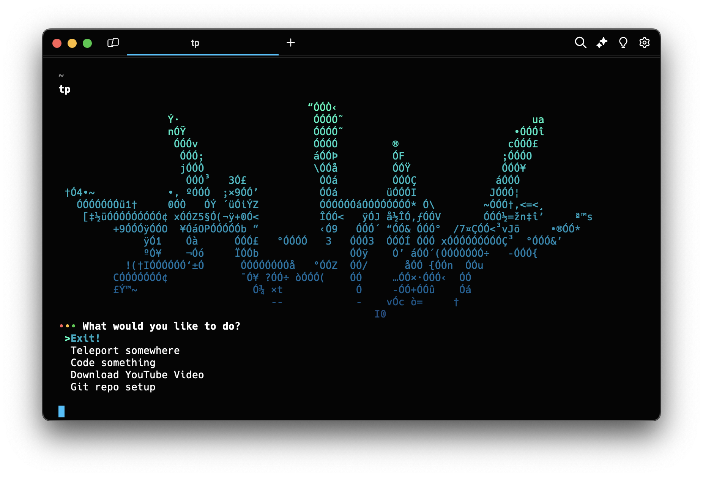

# Terminal Helper :speedboat:

Collection of Zsh scripts that have been linked to an alias to increase my productivity.

## Description

These Zsh scripts are all reached by the menu provided with main.sh, different menu options link to other scripts to do common operations that are sometimes lengthy or annoying to type out.  I have created an alias to main.sh so that I can run it from anywhere, this has boosted my productivity and most importantly been a fun process!



## Getting Started

### Dependencies

* I use Warp terminal for mac, it provides full color options.

### Installing

* If you would like to use this, you will need to modify the scripts to work with your specific pathnames, I have tried to abstract it as much as possible.

### Executing program

```
. ./main.sh
```

## Authors

:key: ListenToAJ

## Current Features Added:

* Options to go to most used directories.
* Options to create Projects and specific files.
* Automated YouTube mp3/mp4 downloading via yt-dlp and FFmpeg.
* Automated git repo initialization and GitHub remote connecting.


## Version History

* 0.1
    * Initial Release

## License

Copyright 2024 Anthony Simao